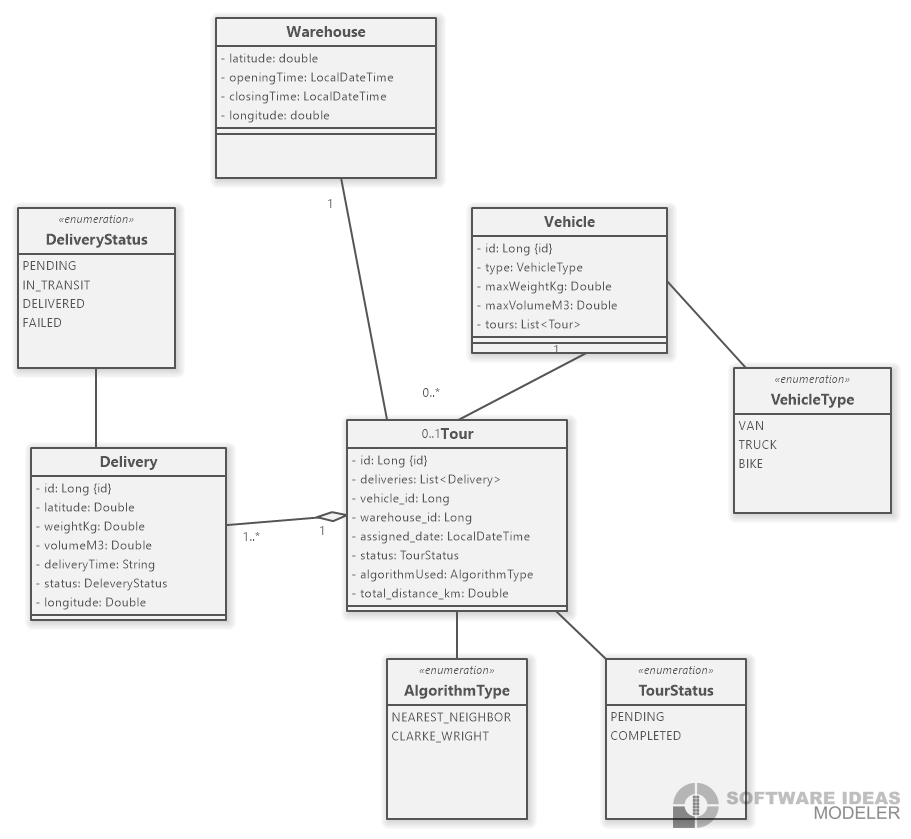
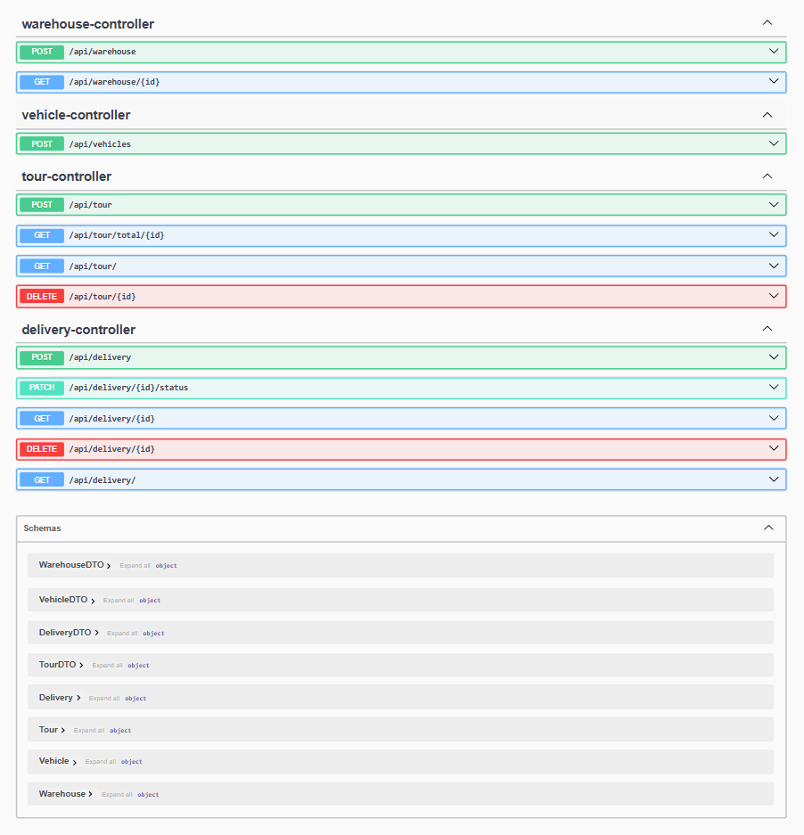

# Route Management System (RMS)

A small Spring Boot application that demonstrates a route/delivery/tour management backend. This repository includes an in-memory H2 DB for quick testing, a few optimization algorithms (Clarke-Wright and Nearest Neighbor), and REST controllers for managing deliveries, vehicles, tours and warehouses.

## Contents

- `src/main/java/...` — Spring Boot application and controllers
- `RMS.png` — Class diagram (architecture / domain model)
- `api.png` — Screenshot of the Swagger / OpenAPI UI


- Class diagram: 
- API docs (Swagger UI screenshot): 

## Architecture / Class diagram

The class diagram above (`RMS.png`) shows the main domain objects (Delivery, Tour, Vehicle, Warehouse), DTOs and mappers, and the service layer where optimizers are implemented.

## API Documentation (Swagger / OpenAPI)

This project includes springdoc OpenAPI UI. When the app is running you can view the interactive API documentation at:

- Swagger UI: http://localhost:8080/swagger-ui/index.html
- OpenAPI JSON: http://localhost:8080/v3/api-docs

The `api.png` file in the repository is a screenshot of the running Swagger UI.

## Example endpoints

The controllers expose the following base paths (see controller sources for full details and request/response bodies):

- DeliveryController — `POST /api/delivery` (create), `GET /api/delivery/` (list), `GET /api/delivery/{id}`, `DELETE /api/delivery/{id}`, `PATCH /api/delivery/{id}/status`
- TourController — `POST /api/tour` (create / optimize), `GET /api/tour/` (list), `DELETE /api/tour/{id}`, `GET /api/tour/total/{id}`
- VehicleController — `POST /api/vehicles` (create)
- WarehouseController — `POST /api/warehouse`, `GET /api/warehouse/{id}`

Check `src/main/java/com/route_management_system/RMS/controller/` for full method signatures and DTO shapes.

## Prerequisites

- Java 17
- Git (optional)
- Maven (you can use the provided wrapper `mvnw` / `mvnw.cmd`)

## Run locally (Windows PowerShell)

Build and run with the included Maven wrapper:

```powershell
.\mvnw.cmd clean package
.\mvnw.cmd spring-boot:run
```

Or build and run the jar:

```powershell
.\mvnw.cmd clean package
java -jar target\RMS-0.0.1-SNAPSHOT.jar
```

Once started, open http://localhost:8080/swagger-ui/index.html to explore the API.

## Development notes

- Java version is set to 17 in `pom.xml`.
- The project uses `springdoc-openapi-starter-webmvc-ui` to provide Swagger UI integration.
- H2 is used as an in-memory database for tests and quick development. You can open the H2 console (if enabled) or configure a persistent DB in `application.properties`.

## Project structure (high-level)

- `controller/` — REST controllers exposing the API
- `service/` — Business logic, optimizers, and service implementations
- `model/` — Entities, DTOs, enums and mappers
- `repository/` — Spring Data JPA repositories

## Tests

There are unit tests under `src/test/java/...` for services. Run them with:

```powershell
.\mvnw.cmd test
```


---

- Saad El Quaul ([@saadelquaul](https://github.com/saadelquaul))

